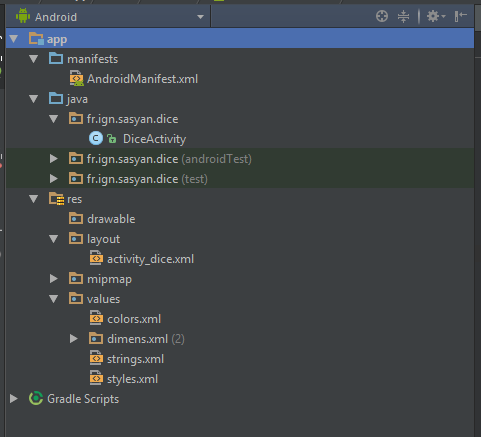

# Les bases (théoriques) d'Android

## L'environnement

### Plateforme et Architecture

* Smartphone utilisation particulière
* Java, langage multiplateforme
* A chaque version d'Android est associée une API
 * gestion des vues
 * partage de données (Contacts, ...)
 * notifications
 * gestion des capteurs

### Environnement de développement

* Android Studio
 * Android SDK Manager
 * Android AVD : Android Virtual Device
 * Android ADB : Android Debug Bridge
 * Logcat

## Organisation

### Structure d'un projet

### Détails des fichiers

#### Manifest

* Manifest : informations de base concernant l'application
 * Nom et icône
 * Permissions
 * Compatibilité (API)
 * Liste des activités

#### Ressources

* Ressources : l'ensemble des données
 * drawable : images
 * layout : les vues en XML
 * menu : les menus en XML
 * values : toutes les constantes (strings, couleurs, ...)

#### java

* Les classes java
 * Activités : contrôleurs associés aux vues
 * Services : classes spécialisées permettant de gérer les données
 * ...
