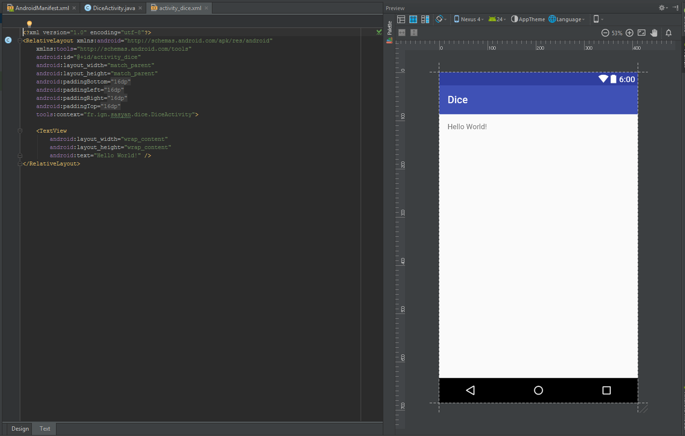
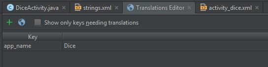
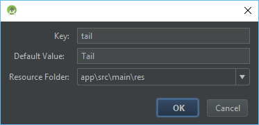
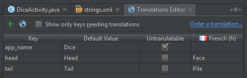
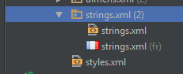

# Les bases (pratiques) d'Android

Pour mettre en pratique l'utilisation d'Android Studio et prendre
en main un projet Android, nous allons créer une application simulant
un lancé de pièce (pile ou face).


## Le principe de l'application

L'application sera composée d'une vue permettant d'afficher du texte (TextView).
Il y aura, stockés dans les ressources, deux labels correspondant aux résultats
en français et anglais ("Pile" ou "Face" et "Tail" ou "Head").

Au démarrage de l'application, le programme génère un nombre égale à 0 ou 1, et
affiche le label correspondant. L'utilisateur peut effectuer un nouveau lancé en cliquant sur un bouton.

Grâce à la bonne utilisation des fichiers de ressources, l'application est
automatiquement traduite (vous pouvez changer la langue de votre téléphone pour voir).


## Mise en place

Créez un nouveau projet appelé "Dice" :


Regardez la structure du projet créé par Android Studio :


Ouvrez les fichiers `manifest`, `DiceActivity`, et `activity_dice` en mode Design et Text :





## Pas à pas des modifications

### 1) Modification de la vue

Dans un premier temps, il faut modifier la vue pour ajouter une zone de texte.
Modifier le TextView automatiquement ajouté par Android Studio : renommez le en `tv_dice_results`, agrandissez-le pour qu'il prenne tout l'espace et videz le texte qu'il contient.

Vous devez obtenir le code suivant :

```xml
    <TextView
        android:text=""
        android:layout_width="wrap_content"
        android:layout_height="wrap_content"
        android:id="@+id/tv_dice_results"
        android:layout_alignParentTop="true"
        android:layout_alignParentLeft="true"
        android:layout_alignParentStart="true"
        android:layout_alignParentBottom="true"
        android:layout_alignParentRight="true"
        android:layout_alignParentEnd="true" />
```

### 2) Ajout des labels dans les fichiers strings

Ouvrez le fichier `res/values/string.xml`. Android Studio doit automatiquement afficher un message vous proposant de traduire, cliquez sur « Open editor » (sinon faites un clique-droit sur le fichier `string.xml` et choisissez « Open Translations Editor »).

Cliquez sur la petite croix verte :



Remplissez la fenêtre (faites de même avec « head ») :



Cliquez sur la petite Terre bleue et sélectionnez « French ».


Le programme doit ajouter une nouvelle colonne qu'il suffit de compléter, voici le résultat à obtenir :



Remarquez que le programme a en fait créé un deuxième fichier XML :
* `res/values/strings.xml` (dossier par défaut)
* `res/values-fr/strings.xml` (dossier en *fr*ançais)



### 3) Modification de l'activité

Nous allons maintenant modifier l'activité. La méthode `onCreate` est exécutée à la création de l'activité. Comme cette activité est l'activité de démarrage de l'application, cette fonction sera exécutée sans intervention de l'utilisateur.

Vous pouvez voir qu'il y a deux lignes dans la fonctions, elle permettent d'afficher la vue, effectuez vos modifications après.

Il faut dans un premier temps récupérer le TextView dans la vue, ensuite, on génère un nombre égal à 1 ou 0, enfin, on ajout dans le TextView le label correspondant au nombre généré.

Voici la fonction onCreate à obtenir :

```java
    @Override
    protected void onCreate(Bundle savedInstanceState) {
        super.onCreate(savedInstanceState);
        setContentView(R.layout.activity_dice);

        // Get the TextView
        TextView tv_diceResults = (TextView)findViewById(R.id.tv_dice_results);

        // Creation of a randomGenerator
        Random randomGenerator = new Random();

        // Tail or not Tail that is the question?
        boolean tail = randomGenerator.nextBoolean();

        // Put the result in a string
        String result;
        if (tail) {
            result = getResources().getString(R.string.tail);
        } else {
            result = getResources().getString(R.string.head);
        }

        // Set the result
        tv_diceResults.setText(result);
    }
```

Remarquez les `import` à effectuer :

```java
import android.support.v7.app.AppCompatActivity;
import android.os.Bundle;
import android.widget.TextView;

import java.util.Random;
```

Vous utilisez des librairies, il faut donc les importer (Android Studio arrive très bien à vous proposer d'ajouter automatiquement les librairies les plus courantes, utilisez le `Alt+Entrer`).

### 4) Lancement de l'application

Connectez votre téléphone à l'ordinateur et lancez le programme dans Android Studio (`Maj+F10`).
Android Studio ouvre une fenêtre : sélectionnez votre mobile. L'application doit se lancer sur votre téléphone !

### 5) Ajout du bouton

Votre programme fonctionne ! On va maintenant ajouter un bouton pour que l'utilisateur puisse relancer une pièce !

Ajouter un bouton dans la vue, en haut, nommez-le `b_coin_flip`. Au clique (attribut `onClick`), on doit lancer la fonctionne `coinFlip` (à ajouter ensuite à l'activité `DiceActivity`). Personnalisez le label du bouton en utilisant une ressource...

Voici le code XML obtenu :

```xml
<?xml version="1.0" encoding="utf-8"?>
<RelativeLayout xmlns:android="http://schemas.android.com/apk/res/android"
    xmlns:tools="http://schemas.android.com/tools"
    android:id="@+id/activity_dice"
    android:layout_width="match_parent"
    android:layout_height="match_parent"
    android:paddingBottom="@dimen/activity_vertical_margin"
    android:paddingLeft="@dimen/activity_horizontal_margin"
    android:paddingRight="@dimen/activity_horizontal_margin"
    android:paddingTop="@dimen/activity_vertical_margin"
    tools:context="fr.ign.sasyan.dice.DiceActivity">

    <Button
        android:text="@string/coin_flip"
        android:layout_width="wrap_content"
        android:layout_height="wrap_content"
        android:layout_alignParentTop="true"
        android:layout_alignParentLeft="true"
        android:layout_alignParentStart="true"
        android:id="@+id/b_coin_flip"
        android:layout_alignParentRight="true"
        android:layout_alignParentEnd="true"
        android:onClick="coinFlip" />

    <TextView
        android:text=""
        android:layout_width="wrap_content"
        android:layout_height="wrap_content"
        android:id="@+id/tv_dice_results"
        android:layout_alignParentLeft="true"
        android:layout_alignParentStart="true"
        android:layout_alignParentBottom="true"
        android:layout_alignParentRight="true"
        android:layout_alignParentEnd="true"
        android:layout_below="@+id/b_coin_flip" />
</RelativeLayout>
```

La **ligne la plus important** est le `android:onClick="coinFlip"`, qui permet d'associer le clique d'un utilisateur sur le bouton à la méthode `coinFlip` de l'activité `DiceActivity`. Cela fonctionne **uniquement** car l'activité et la vue sont associées. De plus, la méthode doit être **publique**.

### 6) Ajout de la fonction

Retourner dans l'activité `DiceActivity`. Ajouter une fonction publique `coinFlip`.
Réagencer le code pour que le programme ajoute les lancés à la suite des autres.

Modifiez la méthode `onCreate` pour qu'elle appelle la fonction coinFlip (au lieu de dupliquer le code).

Note : signature de la fonction `coinFlip`  
La fonction `coinFlip` doit avoir une signature particulière pour être appelée par l'évènement `onClick` : elle ne doit rien retourner (`void`) et prendre en paramètre une instance de la classe `View` : `void coinFlip(View view)`.
Pour appeler cette fonction, il vous faudra donc lui passer une instance nulle en paramètre : `coinFlip(null);`.

Voici le résultat attendu :

```java
public class DiceActivity extends AppCompatActivity {

    @Override
    protected void onCreate(Bundle savedInstanceState) {
        super.onCreate(savedInstanceState);
        setContentView(R.layout.activity_dice);
        coinFlip(null);
    }

    public void coinFlip(View view) {
        // Get the TextView
        TextView tv_diceResults = (TextView)findViewById(R.id.tv_dice_results);

        // Creation of a randomGenerator
        Random randomGenerator = new Random();

        // Tail or not Tail that is the question?
        boolean tail = randomGenerator.nextBoolean();

        // Put the result in a string
        String result;
        if (tail) {
            result = getResources().getString(R.string.tail);
        } else {
            result = getResources().getString(R.string.head);
        }

        // Get previous results
        String prevResults = tv_diceResults.getText().toString();

        // Add new result
        tv_diceResults.setText(prevResults + "\n" + result);
    }
}
```

### 7) Scroll

Si l'utilisateur fait beaucoup de « pile ou face », il ne pourra pas scroller pour voir les derniers. Pour cela, il faut mettre le TextView dans une ScrollView.

Voici le code XML obtenu :

```xml
<?xml version="1.0" encoding="utf-8"?>
<RelativeLayout xmlns:android="http://schemas.android.com/apk/res/android"
    xmlns:tools="http://schemas.android.com/tools"
    android:id="@+id/activity_dice"
    android:layout_width="match_parent"
    android:layout_height="match_parent"
    android:paddingBottom="@dimen/activity_vertical_margin"
    android:paddingLeft="@dimen/activity_horizontal_margin"
    android:paddingRight="@dimen/activity_horizontal_margin"
    android:paddingTop="@dimen/activity_vertical_margin"
    tools:context="fr.ign.sasyan.dice.DiceActivity">

    <Button
        android:text="@string/coin_flip"
        android:layout_width="wrap_content"
        android:layout_height="wrap_content"
        android:layout_alignParentTop="true"
        android:layout_alignParentLeft="true"
        android:layout_alignParentStart="true"
        android:id="@+id/b_coin_flip"
        android:layout_alignParentRight="true"
        android:layout_alignParentEnd="true"
        android:onClick="coinFlip" />

    <ScrollView
        android:layout_width="match_parent"
        android:layout_height="match_parent"
        android:layout_below="@+id/b_coin_flip"
        android:layout_alignParentLeft="true"
        android:layout_alignParentStart="true">

        <TextView
            android:text=""
            android:layout_width="wrap_content"
            android:layout_height="wrap_content"
            android:id="@+id/tv_dice_results" />
    </ScrollView>
    
</RelativeLayout>
```

## Les points à retenir

Les **ressources** permettent de gérer des *vues*, des images et des *constantes* (chaines de caractères et autres) selon la *langue de l'utilisateur*.

Les **méthodes** associées aux **activités** permettent de coder des fonctionnalités.

Il est possible d'**accéder aux éléments des vues depuis ces méthodes** pour agir dessus et transmettre des informations aux utilisateurs.

Beaucoup de **composants graphiques** existent déjà pour vous aider à développer des interfaces riches sans efforts.


## Projet complet

Vous pouvez retrouver le projet complet ici : [https://bitbucket.org/VSasyan/android_dice](https://bitbucket.org/VSasyan/android_dice)
