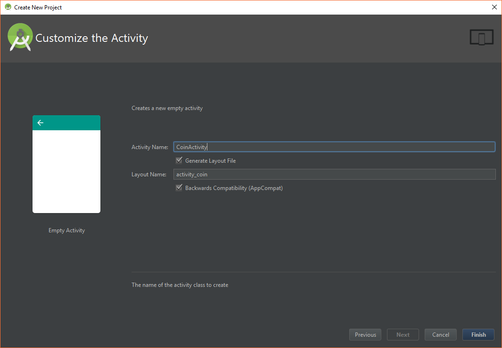
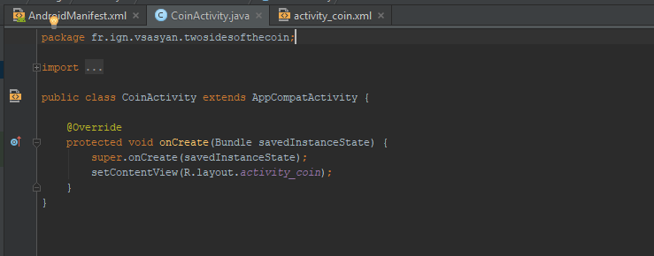
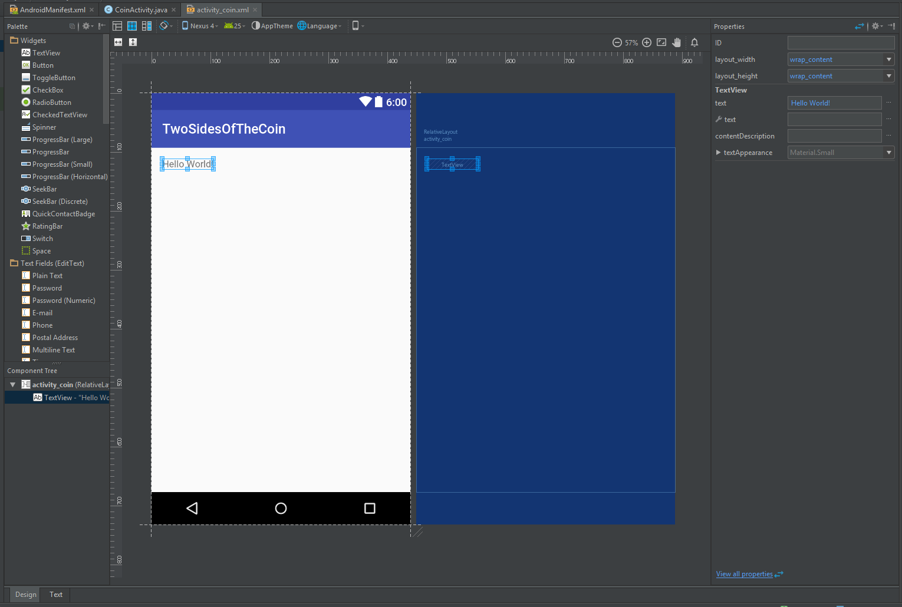
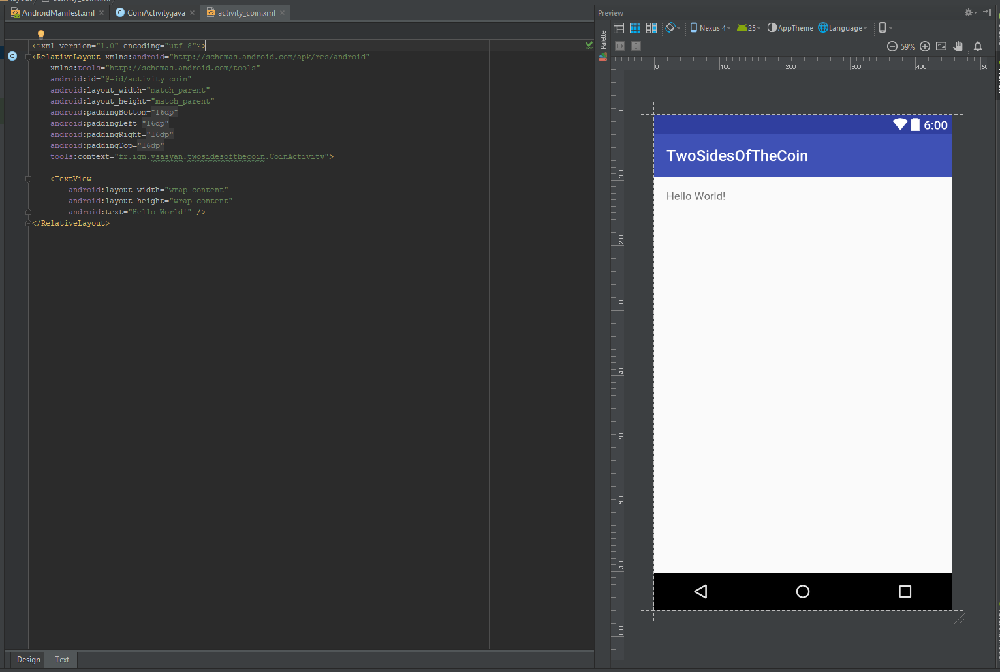
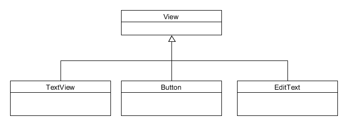

# Les bases (pratiques) d'Android

Pour mettre en pratique l'utilisation d'Android Studio et prendre
en main un projet Android, nous allons créer une application simulant
un lancer de pièce (pile ou face).

## Objectifs

Il y deux objectifs fondamentaux dans cette partie :
* revoir l'utilisation des objets en Java : Déclaration, Instanciation, Utilisation
* introduire le concept d'écoute événementielle.

Vous pouvez consulter [ce document](1_les_bases_theoriques_d_android/README.md) pour plus de détails.

## Le principe de l'application

L'application sera composée d'une vue permettant d'afficher du texte (TextView).
Il y aura, stockés dans les ressources, deux labels correspondant aux résultats
en français et anglais ("Pile" ou "Face" et "Tail" ou "Head").

Au démarrage de l'application, le programme génère un booléen aléatoirement égal à `true` ou `false`, et
affiche le label correspondant. L'utilisateur peut effectuer un nouveau lancer en cliquant sur un bouton.

Grâce à la bonne utilisation des fichiers de ressources, l'application est
automatiquement traduite (vous pouvez changer la langue de votre téléphone pour voir).


## Mise en place

Créez un nouveau projet appelé "TwoSidesOfTheCoin" :




Regardez la structure du projet créé par Android Studio :


Ouvrez les fichiers `manifest`, `CoinActivity`, et `activity_coin` en mode Design et Text :









## Pas à pas des modifications

### 1) Modification de la vue

Dans un premier temps, il faut modifier la vue pour ajouter une zone de texte.
Modifier le TextView automatiquement ajouté par Android Studio : renommez le en `tv_coin_results`, agrandissez-le pour qu'il prenne tout l'espace et videz le texte qu'il contient.

Vous pouvez effectuer cela en utilisant le mode *Design* qui permet d'éditer facilement les composants graphiques et de modifier les propriétés via le menu de droite. Cependant cette interface est limitée, et il est parfois plus rapide d'utiliser le mode *Text*.

Vous devez obtenir le code suivant :

```xml
    <TextView
        android:id="@+id/tv_coin_result"
        android:layout_width="wrap_content"
        android:layout_height="wrap_content"
        android:layout_alignParentRight="true"
        android:layout_alignParentEnd="true"
        android:layout_alignParentLeft="true"
        android:layout_alignParentStart="true"
        android:layout_alignParentBottom="true" />
```

### 2) Ajout des labels dans les fichiers strings

Ouvrez le fichier `res/values/string.xml`. Android Studio doit automatiquement afficher un message vous proposant de traduire, cliquez sur « Open editor » (sinon faites un clique-droit sur le fichier `string.xml` et choisissez « Open Translations Editor »).

Cliquez sur la petite croix verte :


Remplissez la fenêtre (faites de même avec « head ») :


Cliquez sur la petite Terre bleue et sélectionnez « French ».


Le programme doit ajouter une nouvelle colonne qu'il suffit de compléter, voici le résultat à obtenir :


Remarquez que le programme a en fait créé un deuxième fichier XML :
* `res/values/strings.xml` (dossier par défaut)
* `res/values-fr/strings.xml` (dossier en *fr*ançais)


### 3) Modification de l'activité

Nous allons maintenant modifier l'activité. La méthode `onCreate` est exécutée à la création de l'activité. Comme cette activité est l'activité de démarrage de l'application, cette fonction sera exécutée sans intervention de l'utilisateur.

Vous pouvez voir qu'il y a deux lignes dans la fonction, elles permettent d'afficher la vue. Vous devez effectuer vos modifications après.

Il faut dans un premier temps récupérer le `TextView` de la vue, ensuite, on génère un nombre égal à 1 ou 0, enfin, on ajoute dans le `TextView` le label correspondant au nombre généré.

Voici la fonction onCreate à obtenir :

```java
    @Override
    protected void onCreate(Bundle savedInstanceState) {
        super.onCreate(savedInstanceState);
        setContentView(R.layout.activity_dice);

        // Get the TextView
        TextView tv_diceResults = (TextView)findViewById(R.id.tv_coin_result);

        // Creation of a randomGenerator
        Random randomGenerator = new Random();

        // Tail or not Tail that is the question?
        boolean tail = randomGenerator.nextBoolean();

        // Put the result in a string
        String result;
        if (tail) {
            result = getResources().getString(R.string.tail);
        } else {
            result = getResources().getString(R.string.head);
        }

        // Set the result
        tv_diceResults.setText(result);
    }
```

#### Le point à retenir

La ligne la plus importante est :

```java
        // Get the TextView
        TextView tv_diceResults = (TextView)findViewById(R.id.tv_dice_results);
```

Cette ligne permet d'instancier en Java l'objet `TextView` correspondant au code XML écrit à l'étape **1)**.
La fonction `findViewById` de signature `View findViewById(String id)` est fournie par l'API d'Android. Elle permet de récupérer n'importe
quel élément d'une vue et d'en faire un objet Java. Cela permet de pouvoir agir sur l'objet via une fonction Java.

La fonction renvoie un objet `View`. Or tous les éléments que l'on peut afficher héritent de l'objet `View`.
On doit donc *caster* l'objet (en ajoutant le `(TextView)`), ce qui revient à préciser à Java que l'objet est un `TextView` et non autre chose (`EditText`, `Button`, ...).

Extrait du diagramme UML des composants graphiques :




#### Remarque sur les imports :

Remarquez les `import` à effectuer :

```java
import android.support.v7.app.AppCompatActivity;
import android.os.Bundle;
import android.widget.TextView;

import java.util.Random;
```

Vous utilisez des librairies, il faut donc les importer (Android Studio arrive très bien à vous proposer d'ajouter automatiquement les librairies les plus courantes, utilisez le `Alt+Entrer`).

### 4) Lancement de l'application

Connectez votre téléphone à l'ordinateur et lancez le programme dans Android Studio (`Maj+F10`).
Android Studio ouvre une fenêtre : sélectionnez votre mobile. L'application doit se lancer sur votre téléphone !

Vous aurez peut-être besoin d'installer les pilotes ADB : [Voir ce document](Installation des pilotes ADB.pdf)

### 5) Ajout du bouton

Votre programme fonctionne ! On va maintenant ajouter un bouton pour que l'utilisateur puisse relancer une pièce !

Ajouter un bouton dans la vue, en haut, nommez-le `b_coin_flip`. Au clique (attribut `onClick`), on doit lancer la méthode `coinFlip` (à ajouter ensuite à l'activité `DiceActivity`). Personnalisez le label du bouton en utilisant une ressource...

Voici le code XML obtenu :

```xml
<?xml version="1.0" encoding="utf-8"?>
<RelativeLayout xmlns:android="http://schemas.android.com/apk/res/android"
    xmlns:tools="http://schemas.android.com/tools"
    android:id="@+id/activity_dice"
    android:layout_width="match_parent"
    android:layout_height="match_parent"
    android:paddingBottom="@dimen/activity_vertical_margin"
    android:paddingLeft="@dimen/activity_horizontal_margin"
    android:paddingRight="@dimen/activity_horizontal_margin"
    android:paddingTop="@dimen/activity_vertical_margin"
    tools:context="fr.ign.sasyan.dice.DiceActivity">

    <Button
        android:text="@string/coin_flip"
        android:layout_width="wrap_content"
        android:layout_height="wrap_content"
        android:layout_alignParentTop="true"
        android:layout_alignParentLeft="true"
        android:layout_alignParentStart="true"
        android:id="@+id/b_coin_flip"
        android:layout_alignParentRight="true"
        android:layout_alignParentEnd="true"
        android:onClick="coinFlip" />

    <TextView
        android:id="@+id/tv_coin_result"
        android:layout_width="wrap_content"
        android:layout_height="wrap_content"
        android:layout_alignParentLeft="true"
        android:layout_alignParentStart="true"
        android:layout_alignParentBottom="true"
        android:layout_alignParentRight="true"
        android:layout_alignParentEnd="true"
        android:layout_below="@+id/b_coin_flip" />
</RelativeLayout>
```

Nous voulons que Java génère un événement lorsque l'utilisateur clique sur le bouton.
Pour cela, nous devons utiliser un *event listener* (écouteur d'événement).

Il faut donc déclarer un écouteur d'événement :

```java
    // Declare and Instantiate the event listener
    View.OnClickListener eventListener = new View.OnClickListener() {
        @Override
        public void onClick(View v) {
            // Here we have the function that flip the coin
        }
    };
```

Ensuite il faut définir cet écouteur d'événement comme celui qui doit être utilisé lors du clique sur le bouton :

```java
    // Declare the button
    Button b_coin_flip;

    // Instantiate the button
    b_coin_flip = (Button)findViewById(R.id.b_coin_flip);

    // Define eventListener as the OnClickListener of our button
    b_coin_flip.setOnClickListener(eventListener);
```

Vous pouvez à la fin exécuter la fonction `onClick` de l'écouteur d'événement pour lancer une première pièce au démarre de l’application :

```java
    // Now execute ont time the function to flip the coin at the opening
    eventListener.onClick(null);
```

Il faut maintenant déplacer le code qui lançait la pièce dans la fonction `onClick` de la classe d'écoute événementielle.

Voici la structure globale attendue :

```java
public class CoinActivity extends AppCompatActivity {

    @Override
    protected void onCreate(Bundle savedInstanceState) {
        super.onCreate(savedInstanceState);
        setContentView(R.layout.activity_coin);

        // Declare and Instantiate the event listener
        View.OnClickListener eventListener = new View.OnClickListener() {
            @Override
            public void onClick(View v) {
                // Here we have the function that flip the coin

                // Get the TextView
                TextView tv_diceResults = (TextView)findViewById(R.id.tv_coin_result);

                // Creation of a randomGenerator
                Random randomGenerator = new Random();

                // Tail or not Tail that is the question?
                boolean tail = randomGenerator.nextBoolean();

                // Put the result in a string
                String result;
                if (tail) {
                    result = getResources().getString(R.string.tail);
                } else {
                    result = getResources().getString(R.string.head);
                }

                // Add the result
                String finalResult = tv_diceResults.getText().toString() + '\n' + result;
                tv_diceResults.setText(finalResult);
            }
        };

        // Declare the button
        Button b_coin_flip;

        // Instantiate the button
        b_coin_flip = (Button)findViewById(R.id.b_coin_flip);

        // Define eventListener as the OnClickListener of our button
        b_coin_flip.setOnClickListener(eventListener);

        // Now execute ont time the function to flip the coin at the opening
        eventListener.onClick(null);
    }
}
```


### 6) Scroll

Si l'utilisateur fait beaucoup de « pile ou face », il ne pourra pas scroller pour voir les derniers. Pour cela, il faut mettre le TextView dans une ScrollView.

Vous pouvez modifier la vue pour que le TextView soit contenu dans une ScrollView.

Voici le code XML obtenu :

```xml
<?xml version="1.0" encoding="utf-8"?>
<RelativeLayout
    xmlns:android="http://schemas.android.com/apk/res/android"
    xmlns:tools="http://schemas.android.com/tools"
    android:id="@+id/activity_dice"
    android:layout_width="match_parent"
    android:layout_height="match_parent"
    android:paddingBottom="@dimen/activity_vertical_margin"
    android:paddingLeft="@dimen/activity_horizontal_margin"
    android:paddingRight="@dimen/activity_horizontal_margin"
    android:paddingTop="@dimen/activity_vertical_margin"
    tools:context="fr.ign.vsasyan.twosidesofthecoin.CoinActivity" >

    <Button
        android:text="@string/coin_flip"
        android:layout_width="wrap_content"
        android:layout_height="wrap_content"
        android:layout_alignParentTop="true"
        android:layout_alignParentLeft="true"
        android:layout_alignParentStart="true"
        android:id="@+id/b_coin_flip"
        android:layout_alignParentRight="true"
        android:layout_alignParentEnd="true" />

    <ScrollView
        android:layout_width="match_parent"
        android:layout_height="match_parent"
        android:layout_below="@+id/b_coin_flip"
        android:layout_alignParentLeft="true"
        android:layout_alignParentStart="true">

        <TextView
            android:id="@+id/tv_coin_result"
            android:layout_width="wrap_content"
            android:layout_height="wrap_content" />
    </ScrollView>

</RelativeLayout>
```

## Les points à retenir

Les **ressources** permettent de gérer des *vues*, des images et des *constantes* (chaînes de caractères et autres) selon la *langue de l'utilisateur*.

Les **méthodes** associées aux **activités** permettent de coder des fonctionnalités.

Il est possible d'**accéder aux éléments des vues depuis ces méthodes** pour agir dessus et transmettre des informations aux utilisateurs.

Beaucoup de **composants graphiques** existent déjà pour vous aider à développer des interfaces riches sans efforts.

Pour **agir sur les composants graphiques** il faut :
* **instancier des objets Java représentant ces composants** (via `findViewById`) ;
* déclare et associer des **écouteurs d'événements** (event listerners).

## Projet complet

Vous pouvez retrouver le projet complet ici : [https://bitbucket.org/VSasyan/android_twosidesofthecoin/src](https://bitbucket.org/VSasyan/android_twosidesofthecoin/src)
