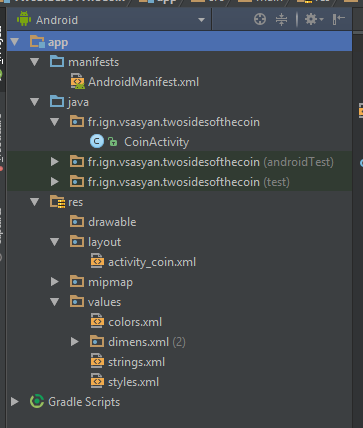

# Les bases (pratiques) d'Android

Pour mettre en pratique l'utilisation d'Android Studio et prendre
en main un projet Android, nous allons créer une application simulant
un lancé de pièce (pile ou face).

## Le principe de l'application

L'application sera composée d'une vue permettant d'afficher un text (TextView).
Il y aura, stockés dans les ressources, deux labels correspondant aux résultats
en français et anglais ("Pile" ou "Face" et "Tail" ou "Head").

Au démarrage de l'application, le programme génère un nombre égale à 0 ou 1, et
affiche le label correspondant. L'utilisateur peut effectuer un nouveau lancé en cliquant sur un bouton.

Grâce à la bonne utilisation des fichiers de ressources, l'application est
automatiquement traduite (vous pouvez changer la langue de votre téléphone pour voir).

## Mise en place

Créez un nouveau projet appelé "Dice" :


Regardez la structure du projet créé par Android Studio :



Ouvrez les fichiers `manifest`, `DiceActivity`, et `activity_dice` en mode Deisgn et Text :


## Pas à pas des modifications

### 1) Modification de la vue

Dans un premier temps, il faut modifier la vue pour ajouter une zone de text.
Modifier le TextView automatiquement ajouté par Android Studio : rennommez le en `tv_dice_results` et agrandissezz-le pour qu'il prenne tous l'espace.

Vous devez obtenir le code suivant :

```xml
    <TextView
        android:text="TextView"
        android:layout_width="wrap_content"
        android:layout_height="wrap_content"
        android:id="@+id/tv_dice_results"
        android:layout_alignParentTop="true"
        android:layout_alignParentLeft="true"
        android:layout_alignParentStart="true"
        android:layout_alignParentBottom="true"
        android:layout_alignParentRight="true"
        android:layout_alignParentEnd="true" />
```

### 2) Ajout des labels dans les fichiers strings

Ouvrez le fichier `res/values/string.xml`. Android Studio doit automatiquement afficher un mesage vous proposant de traduire, cliquez sur « Open editor » (sinon faites un clique-droit sur le fichier `string.xml` et choisissez « Open Translations Editor »).

Cliquez sur la petite croix verte :


Remplissez la fenêtre (faites de même avec « head ») :


Cliquez sur la petite Terre bleue et selectionnez « French ».


Le programme doit ajouter une nouvelle colonne qu'il suffit de compléter, voici le résultat à obtenir :


Remarquez que le programme a en fait créé un deuxième fichier XML :
* `res/values/strings.xml` (dossier par défaut)
* `res/values-fr/strings.xml` (dossier en *fr*ançais)


### 3) Modification de l'activité

Nous allons maintenant modifier l'activité. La méthode `onCreate` est exécutée à la création de l'activité. Comme cette activité est l'activité de démarrage de l'application, cette fonction sera exécutée sans intervention de l'utilisateur.

