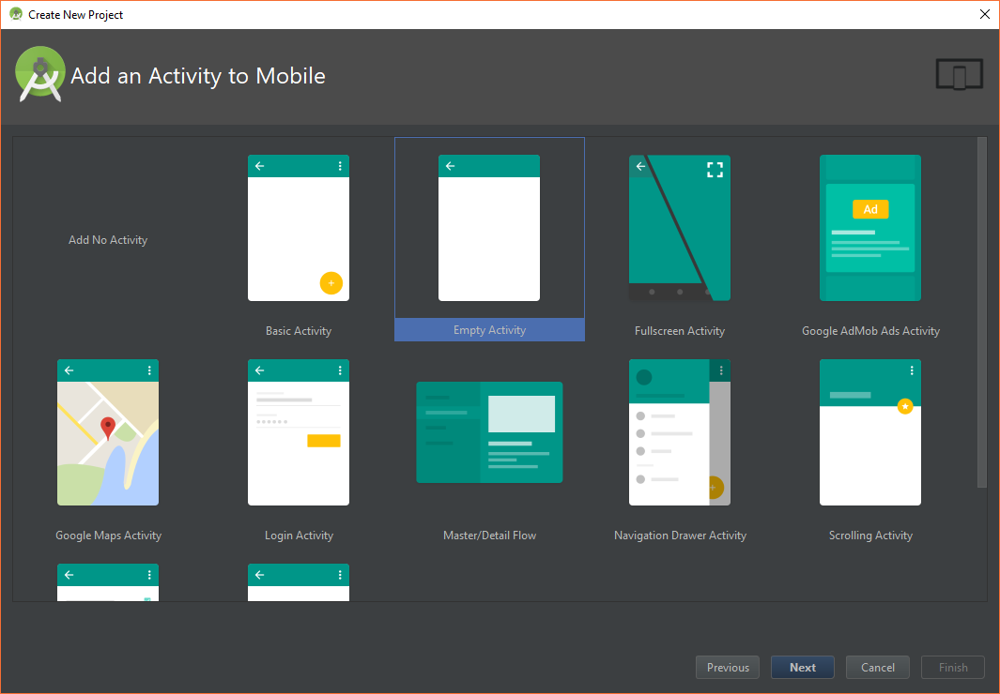

# Les bases (pratiques) d'Android

Pour mettre en pratique l'utilisation d'Android Studio et prendre
en main un projet Android, nous allons créer une application simulant
un lancé de pièce (pile ou face).

## Le principe de l'application

L'application sera composée d'une vue permettant d'afficher un text (TextView).
Il y aura, stocké dans les ressources, deux strings correspondant aux résultats
en français et anglais ("Pile" ou "Face" et "Tails" ou "Heads").

Au démarrage de l'application, le programme génère un nombre égale à 0 ou 1, et
affiche le label correspondant. L'utilisateur peut effectuer un nouveau lancé en cliquant sur un bouton.

Grâce à la bonne utilisation des ficheirs de ressources, l'application est
automatiquement traduite (vous pouvez changer la langue de votre téléphone pour voir).

## Mise en place

Créez un nouveau projet appelé "Dice" :

Regardez la structure du projet créé par Android Studio :

Ouvrez les fichiers `manifest`, `DiceActivity`, et `activity_dice` en mode Deisgn et Text :

