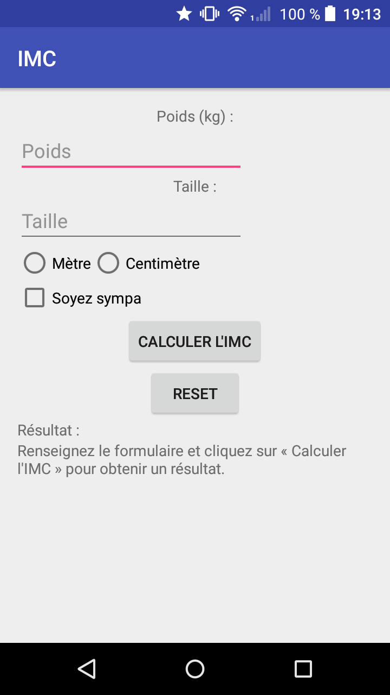
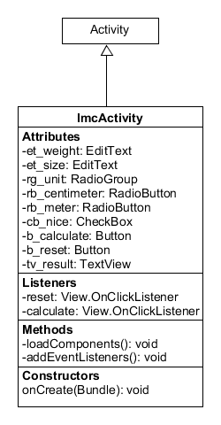

# Une gestion avancée des événements

Nous allons créer une nouvelle application permettant de calculer l'IMC de l'utilisateur. Le but est de manipuler plus de composants graphiques pour se familiariser avec l'instanciation d'objets en Java.

## GUI

Voici l'interface graphique à obtenir :



Pour obtenir cela, il vous faudra utiliser les composants suivants :
* TextView : un composant déjà utilisé permettant d'afficher du texte ;
* EditText : un composant permettant à l'utilisateur de saisir du texte (ils peuvent être spécialisés, par exemple pour la **saisie de nombres**, adresses mail, etc) ;
* Button : un composant déjà utilisé ;
* RadioButton : un composant permettant de gérer une liste de choix ;
* RadioGroup : un composant permettant de définir des groupements de RadioButton ;
* CheckBox : un composant permettant de saisir un booléen.

## Fonctionnalités demandées

L'application doit calculer l'IMC de l'utilisateur lorsque le formulaire est correctement rempli en prenant en compte l'unité utilisée par l'utilisateur.

Si la case « Soyez sympa » est cochée, la phrase de résultat affichée doit mentir à l'utilisateur.

Un clique sur le bouton reset permet de réinitialiser le formulaire (et la phrase de résultat).

Phrases de résultat :
* à la base : "Renseignez le formulaire et cliquez sur « Calculer l'IMC » pour obtenir un résultat." ;
* par défaut : "Votre IMC est de %.2f : %s" ;
* sympa : "Votre IMC est de %.2f : c'est vraiment génial...".

Commentaires :
* si 17 < imc < 30 : "c'est vraiment génial !" ;
* sinon : "c'est gênant...".

**Stockez ces phrases dans les ressources** (pensez à échapper les caractères spéciaux : `'` => `\'`.

Pour rappel :


où T est la taille en *mètre* et P le poids en *kilogramme*.

## Guide

### Formatage de String

Comme beaucoup de langages, Java permet de formater les chaînes de caractères avec des variables. Il faut par exemple écrire :

```java
    String result = String.format("Votre IMC est de %.2f.", 1.42);
```

Plutôt que :

```java
    String result = "Votre IMC est de " + 1.42 + ".";
```

Le principal intérêt est que peu importe la langue, la structure sera la même (donc la chaîne à formater peut venir du fichier de ressources...).

Voici une liste non exhaustive des codes pouvant être utilisés :
* pour un string : `%s`
* pour un integer : `%d`
* pour un float/double : `%2.4f` (le "2" donne le nombre minimum de chiffres avant la virgule et "4" le nombre de chiffres après)

Exemples :

```java
    String.format("Mon prénom est %s.", "Valentin"); // Mon prénom est Valentin
    String.format("La réponse est %d", 42); // La réponse est 42
    String.format("Pi vaut %2.4f", Math.PI); // Pi vaut 3.1415
    String.format("Pi vaut %3.2f", Math.PI); // Pi vaut 003.14
```

### Une autre manière d'ajouter des event listeners

Nous avons vu au chapitre précédent qu'il était possible d'ajouter des écouteurs d'événement grâce au code XML.
Il est aussi possible de le faire via le code Java.

Il faut dans un premier temps récupérer le bouton et l'instancier en Java :

```java
    Button b_button = (Button)findViewById(R.id.b_button);
```

Ensuite, il faut lui ajouter un écouteur d'évènement :

* il peut être défini en tant qu'attribut de la classe Activity :

```java
public class ImcActivity extends AppCompatActivity {

    // Component attributes
    Button b_button = null;

    @Override
    protected void onCreate(Bundle savedInstanceState) {
        super.onCreate(savedInstanceState);
        setContentView(R.layout.activity_imc);

        // Instanciate the button
        b_button = (Button)findViewById(R.id.b_button);

        // Add anonym event listener
        b_button.setOnClickListener(toTo);

    }

    // The event listener
    private View.OnClickListener toTo = new View.OnClickListener() {
        @Override
        public void onClick(View v) {
            // The function
        }
    }
}

```

* ou il peut être défini à la volée (on parle d'écouteur d'évènement anonyme) :

```java
public class ImcActivity extends AppCompatActivity {

    // Component attributes
    Button b_button = null;

    @Override
    protected void onCreate(Bundle savedInstanceState) {
        super.onCreate(savedInstanceState);
        setContentView(R.layout.activity_imc);

        // Instanciate the button
        b_button = (Button)findViewById(R.id.b_button);

        // Add anonym event listener
        b_button.setOnClickListener(new View.OnClickListener() {
            @Override
            public void onClick(View v) {
                // The function
            }
        });

    }
}
```

On parle en général d'*event* listener car cela dépend du type d'événement. Sur un bouton, on va souhaiter détecter un clique (grâce à l'objet `OnClickListener` et sa méthode `OnClick`), dans un champ de texte (`EditText`) on va plutôt souhaiter suivre l'évolution du texte (grâce à l'objet `TextWatcher` et ses méthodes `onTextChanged`, `beforeTextChanged` ou `afterTextChanged` par exemple).

Notez bien que l'écouteur d'évènement est un **objet** et non une **simple méthode** (comme en Javascript par exemple). Le code à exécuter est donc contenu dans une de ses méthodes (par exemple la méthode `OnClick` dans le cas d'un `OnClickListener`).

### Comment démarrer ?

On a vu grâce à l'exercice précédent qu'il vous faudra :
* (XML) créer la vue en fichier XML ;
* (Java Activity) créer les écouteurs d'événement à lier aux composants ;
* (Java Activity) récupérer les composants et les instancier en objets Java ;
* (Java Activity) lier les écouteurs d'événement aux boutons pour que l'utilisateur puisse utiliser l'application.

Pour le premier point, ça doit être une tâche facile.

Pour le 2ème point, créez deux `View.OnClickListener` en attribut de votre classe `ImcActivity`, ce sont les écouteurs d'événements qui seront associés aux boutons dans la fonction `addEventListener`. L'un s'appellera `reset` et l'autre `calculate`. Il vous reste à implementer chaque méthode `OnClick` pour remettre à zéro l'application ou pour calculerl'IMC et afficher les bons résultats.

Pour les deux derniers points, je vous conseille de créer deux fonctions privées `loadComponents` et `addEventListeners` regroupant le code à effectuer pour ces deux tâches, il suffira de les appeler dans la fonction `OnCreate`.

Voici le schéma UML de votre classe `ImcActivity` :



## Projet complet

Vous pouvez retrouver le projet complet ici : [https://bitbucket.org/VSasyan/android_imc](https://bitbucket.org/VSasyan/android_imc)
