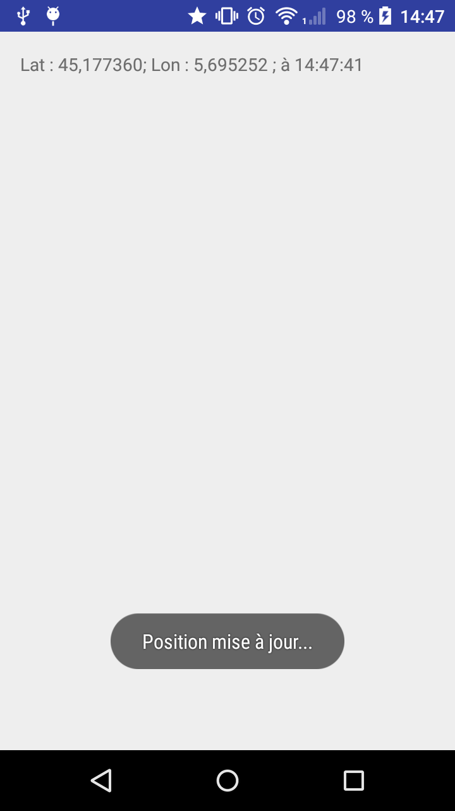
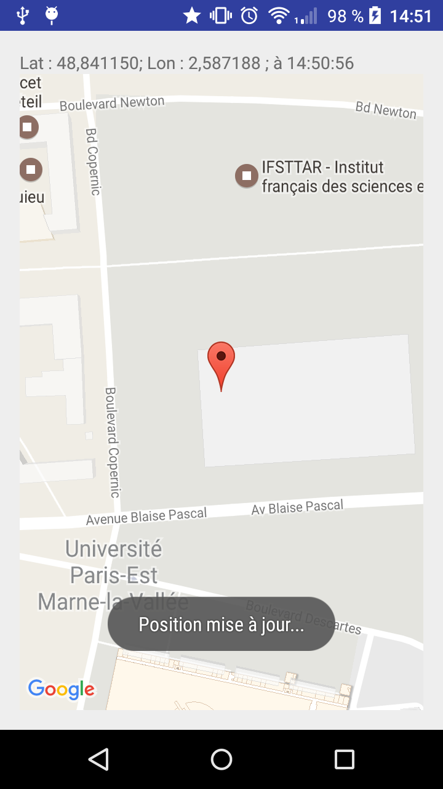
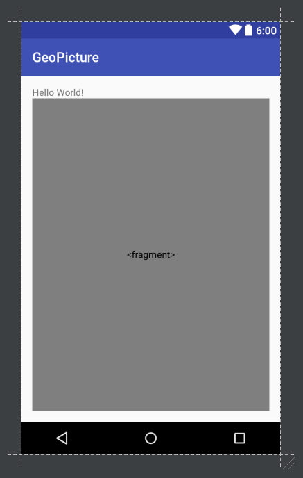
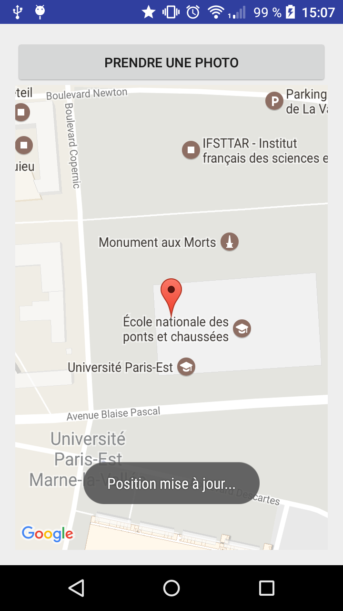
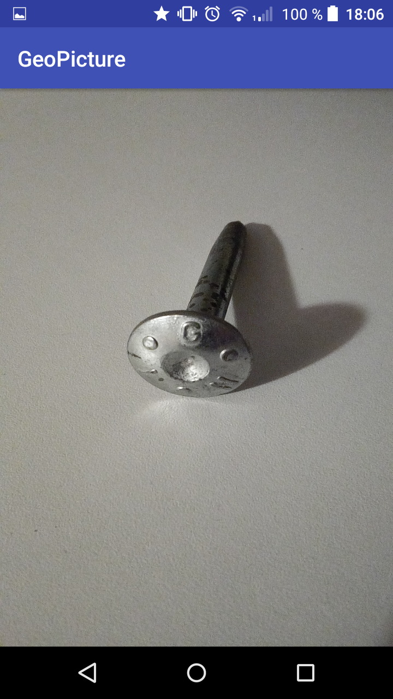
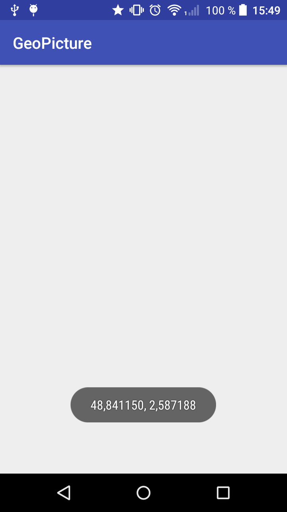
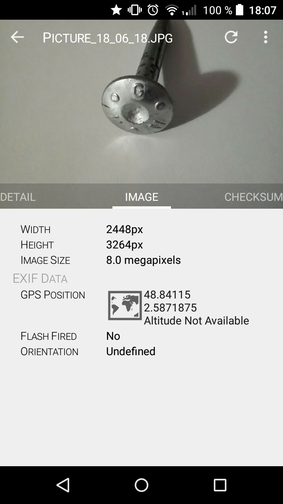

# Géolocalisation et Appareil photo

Dans de nombreuses applications, connaître la position de l'utilisateur est déterminant.
Cela est directement géré par l'API Android et il est donc très simple d'accéder à ces données via une application.

Il peut être intéressant de coupler cette fonction à la prise de photo (afin de créer des photos géo-référencées).


## Géolocalisation

Nous allons créer une application simple affichant les coordonnées de l'utilisateur :



### Autorisation

Pour cela, il faut dans un premier temps que l'application ait le droit d'**utiliser la position de l'utilisateur**. Cela se passe dans le fichier `AndroidManifest.xml`.

Il y a deux types de **permission** de localisation existants :
* `ACCESS_COARSE_LOCATION` : pour une localisation approximative (via le WiFi et les antennes téléphoniques) ;
* `ACCESS_FINE_LOCATION` : pour une localisation précise (via GNSS) ;

La première permission est automatiquement acquise lorsque la seconde est demandée.

Ajoutez donc les lignes suivantes dans la balise `manifest` du fichier XML :

```xml
    <uses-permission android:name="android.permission.ACCESS_FINE_LOCATION" />
    <!-- Needed only if your app targets Android 5.0 (API level 21) or higher. -->
    <uses-feature android:name="android.hardware.location.gps" android:required="true" />
```

On ne demande que la plus précise. Il y a deux lignes car la syntaxe de demande de permission change à partir de la version 21 de l'API d'Android.

### Création du gestionaire de position

Dans un deuxième temps, il faut instancier un objet qui va gérer le suivi de position : le `LocationManager`.

Dans la fonction `OnCreate` de l'activité, ajoutez la ligne :

```java
		LocationManager locationManager = (LocationManager)getSystemService(Context.LOCATION_SERVICE);
```

### Fournisseur de position

Comme l'a suggéré le paragraphe sur les permissions, la localisation du téléphone peut venir de différentes sources. Et elles n'ont pas forcément la même qualité !

L'API d'Android permet de sélectionner automatiquement les bonnes sources en utilisant des critères.

Pour aller plus vite, nous utiliserons uniquement une source dans cet exercice. Elle sera fixée en dur dans le code : `LocationManager.NETWORK_PROVIDER` (le réseau WiFi ou téléphone, donc).

### Écouteur de position

Lorsque la position du téléphone change, l'API d'Android va créer un événement. On va donc devoir créer un *écouteur de position* pour suivre la position de l’utilisateur. Encore une fois, on fait de la programmation événementielle.

L'écouteur peut-être anonyme ou un attribut de la classe d'activité. Pour cet exemple, nous allons créer un attribut :

```java
public class GeoActivity extends AppCompatActivity {

    @Override
    protected void onCreate(Bundle savedInstanceState) {
        super.onCreate(savedInstanceState);
        setContentView(R.layout.activity_geo);

        // Init the location manager
        LocationManager locationManager = (LocationManager)getSystemService(Context.LOCATION_SERVICE);

        // Init the position eventListener
        try {
            locationManager.requestLocationUpdates(LocationManager.NETWORK_PROVIDER, 42000, 42, locationListener);
            // App is running
            Toast.makeText(GeoActivity.this, "Application lancée...", Toast.LENGTH_SHORT).show();
        }
        catch (SecurityException e) {
            // App does not has required permissions
            Toast.makeText(GeoActivity.this, "L'application n'a pas les autorisations requises...", Toast.LENGTH_LONG).show();
        }
    }

    // My private attribut which is the location listener
    private LocationListener locationListener = new LocationListener() {
        @Override
        public void onStatusChanged(String provider, int status, Bundle extras) {
        }

        @Override
        public void onProviderEnabled(String provider) {
        }

        @Override
        public void onProviderDisabled(String provider) {
        }

        @Override
        public void onLocationChanged(Location location) {
            // Here add the code to manage the location
        }

    };
}
```

Comme vous pouvez le voir, l'objet permet :
* de suivre le statut (la qualité) de la position (méthode `onStatusChanged`) ;
* de prévenir l'utilisateur lorsque le suivi de position est perdu/retrouvé (méthodes `onProviderEnabled` et `onProviderDisabled`) ;
* et surtout, de récupérer les coordonnées à chaque nouvelle position (méthode `onLocationChanged`).

Vous devez impérativement *implémenter* ces méthodes, par contre, elles peuvent rester vides : dans cet exercice nous n'utiliserons que la méthode `onLocationChanged`.

Je vous laisse consulter la documentation pour connaître les paramètres de la méthode [requestLocationUpdates](<https://developer.android.com/reference/android/location/LocationManager.html#requestLocationUpdates(java.lang.String,%20long,%20float,%20android.location.LocationListener)>). Utilisez des valeurs adaptées à l’exercice...

Intéressons nous à l'objet `Location` passé en paramètre de la méthode de récupération de la position. La [documentation](https://developer.android.com/reference/android/location/Location.html) nous donne les deux fonctions à utiliser :
* `double getLatitude()` ;
* `double getLongitude()`.

Insérez le code pour 
* afficher dans un TextView nommé "tv_last_position" la position au format : `Lat : 45.361797 ; Lon : 5.597899 : à : 10:42:38` (utiliser `String.format`) ;
* prévenir l'utilisateur avec un `Toast` que la position est actualisée.

Le Toast est un objet Android permettant d'afficher un court message à l'utilisateur :

```java
		Toast.makeText(GeoActivity.this, "Position mise à jour...", Toast.LENGTH_LONG).show();
```

Arguments :
* le contexte où afficher le toast (celui de l'activité) ;
* le message à afficher ;
* le temps d'affichage.

### La première version est terminée

Lancez l'application. Vérifiez que vous obtenez bien la position, qu'elle est actualisée de temps en temps et qu'un Toast s'affiche à chaque modification de position.

## Affichage de la position sur une carte

On va modifier l'activité pour qu'elle puisse afficher sur une carte la position de l'utilisateur :



### Modification de la vue

Pour afficher la carte, il faut ajouter une balise `fragment` dans le fichier XML. Voici le code (dans mon cas, avec votre code le contexte risque de changer...) :

```xml
        <fragment xmlns:android="http://schemas.android.com/apk/res/android"
            xmlns:map="http://schemas.android.com/apk/res-auto"
            xmlns:tools="http://schemas.android.com/tools"
            android:id="@+id/map"
            android:name="com.google.android.gms.maps.SupportMapFragment"
            android:layout_width="match_parent"
            android:layout_height="match_parent"
            tools:context="fr.ign.vsasyan.geopicture.GeoActivity" />
```

Comme cet objet a l'attribut `android:layout_height="match_parent"` il va prendre tout l'espace. Pour structurer votre vue, vous devez ajouter une balise `LinearLayout` avec au moins un attribut `android:orientation="vertical"`. Allez regarder la documentation pour plus de détails... Vous devez ensuite déplacer les balises `TextView` et `fragment` dans cette balise.

Voilà le résultat attendu :



### Modification structurelle de l'activité

Pour cela, il faut modifier notre activité pour qu'elle hérite de l'objet `FragmentActivity`, elle doit aussi implémenter l'interface `OnMapReadyCallback` :

```java
public class GeoActivity extends FragmentActivity implements OnMapReadyCallback {

    GoogleMap mMap;
    Marker mMarker;
    boolean isMapReady = false;

    // ...
}
```

On en profite pour ajouter trois attributs qui vont nous permettre de :
* stocker l'objet qui représente notre carte ;
* stocker l'objet qui représente le marqueur donnant la position de l'utilisateur ;
* dire si la carte est prête ou non.

Cela va nous obliger à implémenter la méthode `OnMapReadyCallback`. Cette méthode est un "callback". Elle va en fait être automatiquement exécutée lorsque que la carte sera chargée.

On va ajouter dans la méthode `onCreate` de l’activité les lignes suivantes :

```java
        // Obtain the SupportMapFragment and get notified when the map is ready to be used.
        SupportMapFragment mapFragment = (SupportMapFragment) getSupportFragmentManager().findFragmentById(R.id.map);
        mapFragment.getMapAsync(this);
```

On récupère le fragment de carte que l'on a ajouté dans la vue et on l'instancie en objet Java. C'est ce composant qui va afficher la carte.
La deuxième ligne permet d'initialiser l'affichage en précisant qu'elle méthode de callback il faut exécuter lorsque la carte est initialisée. On souhaite ici éxécuter la méthode `OnMapReady` attachée à notre activité.

Il faut ensuite implémenter la fonction `onMapReady` :

```java
    @Override
    public void onMapReady(GoogleMap googleMap) {
        mMap = googleMap;
        isMapReady = true;
    }
```

On stocke l'objet qui représente la carte et on passe le booléen `isMapReady` à `true`.

### Modification fonctionnelle de l'activité

Dans la fonction `onLocationChanged` qui met à jour la position de l'utilisateur, nous allons ajouter un code qui actualise la position du marqueur :

```java
            if (isMapReady) {
                // Add a marker and move the camera
                LatLng position = new LatLng(lastLocation.getLatitude(), lastLocation.getLongitude());
                if (mMarker == null) {
                    mMarker = mMap.addMarker(new MarkerOptions().position(new LatLng(0,0)));
                }
                mMarker.setPosition(position);
                mMarker.setTitle(sdf.format(lastTime));
                mMap.moveCamera(CameraUpdateFactory.newLatLngZoom(position, 14));
            }
```

### Notes

Voici le code de la solution proposée :

[https://bitbucket.org/VSasyan/android_geopicture/src - Branche "master"](https://bitbucket.org/VSasyan/android_geopicture/src)

Vous pouvez à ce stade supprimer le `TextView` ainsi que le code utilisé pour le remplir, la carte se suffit à elle-même.

Pour créer une activité carte la prochaine fois, choisissez une "MapActivity" au moment de la création de l'activité et Android Studio vous mâchera le travail...

## Prise d'une photo

On souhaite que l'utilisateur puisse prendre une photo, et que l'on associe la dernière position connue à l'image avant de la sauvegarder sur l'appareil.

Nous allons ajouter un bouton « Prendre une photo » qui ouvrira une **nouvelle activité** permettant à l'utilisateur de prendre une photo et de la sauvegarder.

Interface de départ :



Interface de prise de photo :



### Ajout d'un boutton

Ajout un bouton nommé "b_picture" avec pour texte « Prendre une photo ».

### Utiliser l'appareil photo

Il faut demander les permissions permettant d'utiliser l'appareil photo et d'écrire des fichiers sur la mémoire de l'appareil :

```xml
    <uses-permission android:name="android.permission.CAMERA" />
    <uses-permission android:name="android.permission.WRITE_EXTERNAL_STORAGE" />
    <!-- Needed only if your app targets Android 5.0 (API level 21) or higher. -->
    <uses-feature android:name="android.hardware.camera" android:required="true" />
    <uses-feature android:name="android.hardware.camera.autofocus" android:required="true"/>
    <uses-feature android:name="android.permission.WRITE_EXTERNAL_STORAGE" android:required="true" />
```

### Nouvelle activité

Il faut créer une nouvelle activité `PictureActivity` (File => New => EmptyActivity).

### Lancement d'une nouvelle activité

Pour lancer une nouvelle activité, nous allons ajouter un écouteur d’événement au bouton. La fonction onClick devra vérifier si une position existe (`lastLocation != null`) et lancer la nouvelle activité.

Ce lancement s'effectue grâce à l'objet `Intent` :

```java
                Intent intent = new Intent(GeoActivity.this, PictureActivity.class);
                intent.putExtra("lat", lastLocation.getLatitude());
                intent.putExtra("lon", lastLocation.getLongitude());
                startActivity(intent);
```

Le constructeur à besoin d'un contexte et d'une classe activité. On peut ensuite ajouter des variables (ici les coordonnées de l'utilisateur).

### Récupération de la position

Dans la méthode `onCreate` de la nouvelle activité, il va falloir récupérer cet `intent`. Il faut utiliser les méthodes `getIntent`, `getExtras` et `getDouble` :

```java
        // Recuperation of the position:
        Intent intent = getIntent();
        double lat = intent.getExtras().getDouble("lat");
        double lon = intent.getExtras().getDouble("lon");
        position = new LatLng(lat, lon);
```

On enregistre la position (objet `LatLng`) qui est un attribut de la classe `PictureActivity`.

Vous pouvez essayr dans un premier temps d'afficher un Toast à l'utilisateur :



### Prise de la photo

C'est dans cette partie que ça se complique. On souhaite afficher une prévisualisation à l'utilisateur sur l'ensemble de l'activité. Puis quand l'utilisateur touche l'écran on prend la photo, on la sauvegarde et on retourne à l'activité principale (`GeoActivity`).

#### Modification de la vue

On doit ajouter à la vue une surface sur laquelle on peut afficher un aperçu.
La prévisualisation se fera grâce à l'objet `SurfaceView`, modifiez donc la vue de la **nouvelle activité** pour lui ajouter cet élément (nommé "sv_camera_view").

Regardez dans le menu "Palette" ! Voici le code de l'élément si besoin :

```xml
    <SurfaceView
        android:layout_width="wrap_content"
        android:layout_height="wrap_content"
        android:layout_alignParentTop="true"
        android:layout_alignParentLeft="true"
        android:layout_alignParentStart="true"
        android:id="@+id/sv_camera_view"
        android:layout_alignParentBottom="true"
        android:layout_alignParentRight="true"
        android:layout_alignParentEnd="true" />
```

#### Modification de l'activité

##### Héritage

L’activité doit implémenter les interfaces `SurfaceHolder.Callback` et `Camera.PictureCallback`, cela nous oblige à implémenter les méthodes de création, changement et destruction de surfaces et la méthode `onPictureTaken` :

```java
public class PictureActivity extends AppCompatActivity implements SurfaceHolder.Callback, Camera.PictureCallback {

    // ...

    @Override
    public void surfaceCreated(SurfaceHolder holder) {

    }

    @Override
    public void surfaceChanged(SurfaceHolder holder, int format, int width, int height) {
        
    }

    @Override
    public void surfaceDestroyed(SurfaceHolder holder) {
        
    }

    public void onPictureTaken(byte[] bytes, Camera camera) {

    }
}
```

Nous devrons prochainement ajouter du code dans ces méthodes, avant cela nous allons repartir du début...

##### Les bases

Nous avons vu dans les premiers exercices qu'il était pratique pour bien organiser son code de créer deux méthodes :
* `loadComponents` : la fonction de chargement des composants, nous n'avons qu'un composant à charger : la `SurfaceView` (nommée `sv_cameraView`) ;
* `initEventListeners` : la fonction d'initialisation des événements, nous devons ajouter à l'objet `sv_cameraView` un `OnClickListener` (nommé `event_takePicture`) dont la méthode `onClick` prendra la photo.

Vous aurez deux attributs de classe en plus :
* `SurfaceView` : sv_cameraView ;
* `View.OnClickListener` : event_takePicture.

##### La camera

Nous aurons besoin de nouveaux attributs pour gérer :
* un booléen pour indiquer l'état de la prévisualisation (`boolean isPreview = false`);
* l'objet camera (`Camera camera`) ;
* l'orientation de la camera (`int angleOrientation = 0`) ;
* les changements d'orientation de la camera (`OrientationEventListener orientationEventListener`) ;
* l'auto focus de la camera (`Camera.AutoFocusCallback autoFocusCallback`) :
* l'identifiant de la caméra (`public int cameraId = 0`) pour utiliser la caméra avant ou la caméra arrière.

La camera doit être initialisée à l'affichage de l'activité et doit **absolument** être libérée à sa destruction (sinon les autres applications ne pourront pas y accéder et vont planter...).

Nous avons vu la méthode `onCreate` associée aux activités, il y en a d'autres :
* onCreate : méthode exécutée à la création de l'activité (une fois) ;
* onResume : méthode exécutée lorsque l'on affiche l'activité (à chaque fois) ;
* onPause : méthode exécutée lorsque l'on masque l'activité (à chaque fois) ;
* onDestroy : méthode exécutée à la destruction de l'activité (une fois).

Lorsque l'utilisateur change d'activité ou d'application, la méthode `onPause` est exécutée. C'est en fait à ce moment qu'il faut libérer la caméra, et c'est donc dans la méthode `onResume` qu'il faut initialiser la camera.

Les méthodes `onResume` et `onPause` sont aussi exécutées lorsque l'on affiche une nouvelle activité dans la même application.

Voici le code à mettre dans ces méthodes :

```java
    @Override
    public void onResume() {
        super.onResume();
        camera = Camera.open();
    }

    @Override
    public void onPause() {
        super.onPause();

        if (camera != null) {
            camera.stopPreview();
            camera.release();
            camera = null;
        }
    }
```

**Note** : `onPause` est exécutée avant `onDestroy` et `onResume` est exécutée après `onCreate`.

##### Retour à la surface de prévisualisation

Dans la méthode onCreate, après avoir exécuté les méthodes `loadCoponents` et `initEventListener`, il faut initialiser la SurfaceView :

```java
        sv_camera_view.getHolder().addCallback(this);
        sv_camera_view.getHolder().setType(SurfaceHolder.SURFACE_TYPE_PUSH_BUFFERS);
```

La surface est liée à notre activité, lorsque que l'activité est créée, la surface l'est aussi et quand notre activité est détruite, la surface l'est aussi. Les codes d'initialisation et de libération de la caméra peuvent donc être regroupés dans les fonctions de l'activité (`onResume` et `onPause`).

Cependant, quand l'utilisateur va modifier l'orientation de son téléphone la méthode `surfaceChanged` sera exécutée. Il faut donc que se soit dans cette fonction que l'on gère l'affichage de la prévisualisation sur la surface.

Voici le code à utiliser :

```java
    @Override
    public void surfaceChanged(SurfaceHolder holder, int format, int width, int height) {

        // Stop preview mode if running
        if (isPreview) {
            camera.stopPreview();
        }

        // Get camera parameters
        Camera.Parameters parameters = camera.getParameters();

        // Nous changeons la taille
        parameters.setPreviewSize(parameters.getPreviewSize().width, parameters.getPreviewSize().height);
        parameters.setGpsLatitude(position.latitude);
        parameters.setGpsLongitude(position.longitude);

        // Get the best size for previsualisation
        Camera.Size size;
        size = getBestSize(parameters.getSupportedPreviewSizes());
        parameters.setPreviewSize(size.width, size.height);
        // Get the best picture size for the files :
        size = getBestSize(parameters.getSupportedPictureSizes());
        parameters.setPictureSize(size.width, size.height);

        // Apply new paramters
        camera.setParameters(parameters);

        try { // Make link between surfaceView and the camera
            camera.setPreviewDisplay(sv_cameraView.getHolder());
        } catch (IOException e) {
            // TODO: handle exception
        }

        // Run preview
        camera.startPreview();

        isPreview = true;
    }

    public Camera.Size getBestSize(List<Camera.Size> sizes) {
        Camera.Size bestSize = sizes.get(0);
        for(int i = 1; i < sizes.size(); i++){
            if((sizes.get(i).width * sizes.get(i).height) > (bestSize.width * bestSize.height)){
                bestSize = sizes.get(i);
            }
        }
        return bestSize;
    }
```

##### Orientation

Pour gérer l’orientation de la prévisualisation, nous allons encore utiliser un écouteur d’évènement l'objet `OrientationEventListener` :

```java
    orientationEventListener = new OrientationEventListener(this) {
        public void onOrientationChanged(int orientation) {
            android.hardware.Camera.CameraInfo info = new android.hardware.Camera.CameraInfo();
            android.hardware.Camera.getCameraInfo(cameraId, info);
            int rotation = PictureActivity.this.getWindowManager().getDefaultDisplay().getRotation();
            int degrees = 0;
            switch (rotation) {
                case Surface.ROTATION_0:
                    degrees = 0;
                    break;
                case Surface.ROTATION_90:
                    degrees = 90;
                    break;
                case Surface.ROTATION_180:
                    degrees = 180;
                    break;
                case Surface.ROTATION_270:
                    degrees = 270;
                    break;
            }

            int result;
            if (info.facing == Camera.CameraInfo.CAMERA_FACING_FRONT) {
                result = (info.orientation + degrees) % 360;
                result = (360 - result) % 360; // compensate the mirror
            } else { // back-facing
                result = (info.orientation - degrees + 360) % 360;
            }
            if (camera != null) {camera.setDisplayOrientation(result);}
            angleOrientation = result;
        }
    };
```
Il faut ajouter ce code à la fin de la méthode `onCreate`.

Cet écouteur d'événement est désactivé par défaut, il faut l'activer ou le désactiver dans les méthodes `onResume` et `onPause` (`orientationEventListener.enable()` et `orientationEventListener.disabled()`).

##### Premier test

Lancez l'application, vous devez pouvoir prévisualiser l'image...


##### Prise d'une image

Lorsque l’utilisateur clique sur une image, il faut maintenant sauvegarder une image.

Le code exécuté au clique de l'utilisateur est très simple : on lance un autofocus de la caméra (histoire de prendre une photo nette) :

```java
            if (camera != null) {
                camera.autoFocus(autoFocusCallback);
            }
```

Une fois que l'auto focus est terminé, il va exécuter le callback passé en paramètre (encore une fois, c'est **événementiel**).

Il faut donc initialiser cet objet callback (c'est un attribut de la classe), ajoutez ce code dans la méthode `initEventListeners` :

```java
        autoFocusCallback = new Camera.AutoFocusCallback(){
            @Override
            public void onAutoFocus(boolean arg0, Camera arg1) {
                try {
                    camera.takePicture(null, null, PictureActivity.this);
                } catch (Exception e) {
                    Toast.makeText(PictureActivity.this, "Impossible de sauvegarder la photo : " + e.toString(), Toast.LENGTH_SHORT).show();
                }
            }
        };
```

Enfin, l'enregistrement à proprement parler de la photo se passe dans la méthode `onPictureTaken` :

```java
    public void onPictureTaken(byte[] bytes, Camera camera) {
        File pictureFileDir = Environment.getExternalStoragePublicDirectory(Environment.DIRECTORY_PICTURES);

        if (!pictureFileDir.exists() && !pictureFileDir.mkdirs()) {
            Toast.makeText(PictureActivity.this, "Can't create directory to save image.", Toast.LENGTH_LONG).show();
            return;
        }

        Bitmap bmp = BitmapFactory.decodeByteArray(bytes, 0, bytes.length);
        int width = bmp.getWidth();
        int height = bmp.getHeight();
        Matrix matrix = new Matrix();
        matrix.postRotate(angleOrientation);
        Bitmap rotatedBitmap = Bitmap.createBitmap(bmp, 0, 0, width, height, matrix, true);

        SimpleDateFormat dateFormat = new SimpleDateFormat("HH_mm_ss");
        String date = dateFormat.format(new Date());
        String photoFile = "Picture_" + date + ".jpg";

        String filename = pictureFileDir.getPath() + File.separator + photoFile;

        File pictureFile = new File(filename);

        try {
            FileOutputStream fos = new FileOutputStream(pictureFile);
            boolean result = rotatedBitmap.compress(Bitmap.CompressFormat.JPEG, 90, fos);
            fos.write(bytes);
            fos.close();
            if (result) {
                // Now we add exif information :
                ExifInterface exif = new ExifInterface(filename);
                exif.setAttribute(ExifInterface.TAG_GPS_LATITUDE, getLatTagGPS());
                exif.setAttribute(ExifInterface.TAG_GPS_LONGITUDE, getLonTagGPS());
                exif.setAttribute(ExifInterface.TAG_GPS_LATITUDE_REF, getLatRefTagGps());
                exif.setAttribute(ExifInterface.TAG_GPS_LONGITUDE_REF, getLonRefTagGps());
                exif.setAttribute(ExifInterface.TAG_FLASH, camera.getParameters().getFlashMode());
                exif.saveAttributes();
                Toast.makeText(PictureActivity.this, "New Image saved with the EXIF information: " + photoFile, Toast.LENGTH_LONG).show();
            }
            else {
                Toast.makeText(PictureActivity.this, "Couldn't save image:" + photoFile, Toast.LENGTH_LONG).show();
                //camera.startPreview();
            }
        } catch (Exception error) {
            Toast.makeText(PictureActivity.this, "Image could not be saved.", Toast.LENGTH_LONG).show();
        }

        // Close activity
        finish();
    }
```

Il faut ajouter les méthodes suivantes qui permettent de convertir la position GNSS au bon format (dégrés décimaux => dégrés/minutes/secondes) :

```java
    public String getLatTagGPS() {
        double latitude = Math.abs(this.position.latitude);
        int num1Lat = (int)Math.floor(latitude);
        int num2Lat = (int)Math.floor((latitude - num1Lat) * 60);
        double num3Lat = (latitude - ((double)num1Lat+((double)num2Lat/60))) * 3600000;
        return num1Lat+"/1,"+num2Lat+"/1,"+num3Lat+"/1000";
    }

    public String getLonTagGPS() {
        double longitude = Math.abs(this.position.longitude);
        int num1Lon = (int)Math.floor(longitude);
        int num2Lon = (int)Math.floor((longitude - num1Lon) * 60);
        double num3Lon = (longitude - ((double)num1Lon+((double)num2Lon/60))) * 3600000;
        return num1Lon+"/1,"+num2Lon+"/1,"+num3Lon+"/1000";
    }

    public String getLatRefTagGps() {
        if (this.position.latitude > 0) {return "N";} else {return "S";}
    }

    public String getLonRefTagGps() {
        if (this.position.longitude > 0) {return "E";} else {return "W";}
    }
```

### Notes

Voici le code de la solution proposée :

[https://bitbucket.org/VSasyan/android_geopicture/src - Branche "Photo"](https://bitbucket.org/VSasyan/android_geopicture/src/62017a1e0020666403f93420075f52fe7da1dfb2?at=photo)

Vous pouvez ouvrir une des photos prises à l'aide d'une application spécialisée et regarder ses métadonnées :



La photo est bien **géo-référencée**.

## Conclusion

Dans ce chapitre vous avez appris à :
* lancer une nouvelle activité en lui passant de paramètres ;
* utiliser la géolocalisation ;
* utiliser l'API Google Maps ;
* utiliser l'appareil photo ;
* utiliser de nouveaux callbacks et de nouveaux écouteurs d’événements.
